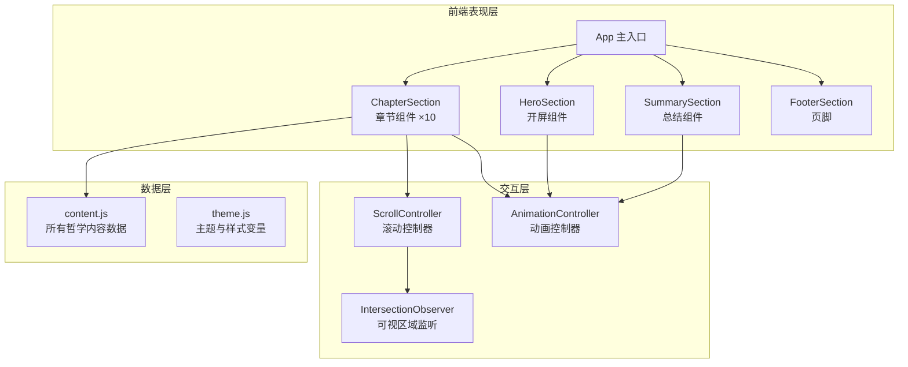

## 1. 架构设计



## 2. 技术选型

| 层级 | 技术 | 说明 |
|------|------|------|
| 前端框架 | React 18 | 组件化构建 |
| 构建工具 | Vite | 快速启动和构建 |
| 样式方案 | 纯 CSS + CSS Variables | 自定义主题，不依赖 Tailwind 或 UI 库 |
| 字体 | Google Fonts: Playfair Display + Cormorant Garamond | 衬线字体组合，哲学气息 |
| 动画 | CSS Animations + Intersection Observer API | 滚动触发的渐入动画 |
| 包管理 | npm | 标准包管理 |

## 3. 路由定义

单页应用，无需路由。所有内容在一个页面中通过滚动呈现。

## 4. 组件结构

```
src/
├── App.jsx              # 主组件，组合所有章节
├── App.css              # 全局样式 + CSS 变量
├── main.jsx             # 入口文件
├── components/
│   ├── HeroSection.jsx       # 开屏 Hero
│   ├── HeroSection.css
│   ├── ChapterSection.jsx    # 通用章节组件
│   ├── ChapterSection.css
│   ├── SummarySection.jsx    # 总结表格
│   ├── SummarySection.css
│   ├── FooterSection.jsx     # 页脚
│   └── FooterSection.css
└── data/
    └── content.js         # 所有章节的文字内容
```

## 5. 数据模型

### 5.1 章节数据结构

```javascript
{
  id: 'biology',
  title: '生物学视角',
  subtitle: '物种分类 vs 功能属性',
  content: '...',        // HTML 字符串或文本
  visualTheme: {          // 每个章节独立的视觉主题
    bgColor: '#...',
    accentColor: '#...',
    fontClass: '...',
    layout: '...'
  },
  highlights: [           // 重点金句
    { text: '...', emphasis: 'high' }
  ]
}
```

### 5.2 主题变量

```css
:root {
  --color-bg: #0a0a0f;
  --color-gold: #c9a94e;
  --color-crimson: #8b2f3a;
  --color-text: #e8e4da;
  --color-text-muted: #8a867e;
  --font-display: 'Playfair Display', serif;
  --font-body: 'Cormorant Garamond', serif;
  --section-min-height: 100vh;
}
```

## 6. 性能优化

- 使用 IntersectionObserver 替代 scroll 事件监听
- 字体使用 `display: swap` 防止 FOIT
- 章节内容懒加载可视区域外的动画
- CSS `will-change` 对动画元素进行提示
